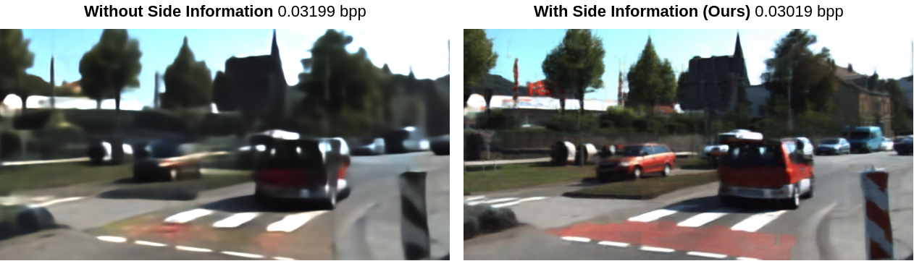

# Deep Image Compression using Decoder Side Information

 

DSIN (Decoder Side Information Network) is the TensorFlow implementation of *Deep Image Compression using Decoder Side Information*

[[Paper]](http://arxiv.org/abs/2001.04753)

### Citation
If you find our work useful in your research, please cite:
```
@article{ayzik2020deep,
  title={Deep Image Compression using Decoder Side Information},
  author={Sharon Ayzik and Shai Avidan},
  journal={arXiv preprint arXiv:2001.04753},
  year={2020}
}
```
## Abstract
We present a Deep Image Compression neural network that relies on side information, which is only available to the decoder. We base our algorithm on the assumption that the image available to the encoder and the image available to the decoder are correlated,  and we let the network learn these correlations in the training phase.

Then, at run time, the encoder side encodes the input image without knowing anything about the decoder side image and sends it to the decoder. The decoder then uses the encoded input image and the side information image to reconstruct the original image.

This problem is known as Distributed Source Coding in Information Theory, and we discuss several use cases for this technology. We compare our algorithm to several image compression algorithms and show that adding decoder-only side information does indeed improve results.

## Prerequisites
* Python 3.5.2
* Installation of all packages specified in *requirements.txt* (```pip install -r requirements.txt```)

### Dataset
Training and testing were performed over *KITTI* dataset. If you wish to use it, please download 
[KITTI 2012](http://www.cvlibs.net/download.php?file=data_stereo_flow_multiview.zip) and [KITTI 2015](http://www.cvlibs.net/download.php?file=data_scene_flow_multiview.zip).

### Weights
Pre-trained models for *KITTI Stereo* and *KITTI General* (as referred in the paper) can be downloaded [here](https://drive.google.com/drive/folders/1j8-ZSmifffyh-vFUXIy-Kyy_3Qlb68Ch?usp=sharing).
Please place the weights under ```src/weights``` folder in the project.


## Inference
In order to perform inference (only), please open the *ae_config* file and change the following lines:
```
crop_size = (320,1224) # we used this crop size for our inference
train_model = False
test_model = True

root_data = '/put/path/to/directory/containig/downloaded/data/folders'
```
 
For *KITTI Stereo*:
```
load_model_name = 'KITTI_stereo_target_bpp0.02' # Model name
file_path_train = 'KITTI_stereo_train.txt' # Name of train.txt file
file_path_val = 'KITTI_stereo_val.txt' # Name of validation.txt file
file_path_test = 'KITTI_stereo_test.txt' # Name of test.txt file
```
* Where ```file_path_...``` is a text file containing the relative paths to the correlated image pairs (one below the other).
* If you wish to train/test on your data, please create txt files with the same structure (relative paths to the correlated image pairs, one below the other) under the folder ```data_path``` and put their names under the relevant fields in the *ae_config* file.
* For *KITTI General*, change all ```stereo``` to ```general```,
When done, under the ```DSIN/src``` folder, run the following command:
```
python main.py
```
All output images will be saved under ```src/images/model_name/``` folder that will be created.

## Train
Open the *ae_config* file and change: ```train_model = True```
Also it is recommended to adjust the following fields:
```
crop_size = (320,960) # we used this crop size for our training
load_model = True/False # Boolean
lr_initial = <your_learning_rate>
```
Saved weights will be saved under ```src/weights``` folder in the project. In addition, a config file (containing the ae_config and pc_config parameters), as well as *last saved* files will be created.

## License
This project is licensed under the MIT License - see the [LICENSE](LICENSE) file for details
